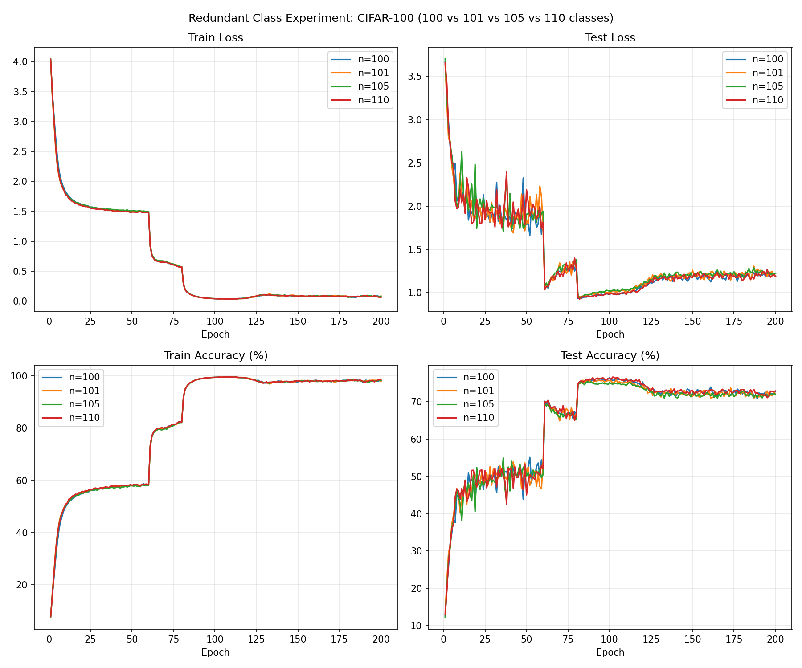

# Redundant Class Experiment (CIFAR-100)

Experiment: adding redundant output classes to CIFAR-100 classification (101, 105, 110 classes vs standard 100) to observe whether it improves performance.

## Setup

```bash
pip install -r requirements.txt
```

## Run

```bash
cd redundant
python run_all.py
```

- 4 experiments (100, 101, 105, 110 classes) run in parallel via subprocesses
- All use `cuda:0`, no pretrained model (ResNet-18 from scratch)
- Logs: `logs/train_100.log`, `logs/train_101.log`, `logs/train_105.log`, `logs/train_110.log`

## Visualization

After training:

```bash
python visualize.py
```

Generates `plots/loss.png`, `plots/accuracy.png`, `plots/combined.png`, and `plots/last20_summary.txt`.

## Results

### Combined Plot (Training & Test Loss / Accuracy)



### Last 20 Epochs Summary (avg ± std)

| num_classes | train_loss | test_loss | train_acc | test_acc |
|-------------|------------|-----------|-----------|----------|
| 100 | 0.0799 ± 0.0086 | 1.2076 ± 0.0247 | 98.11 ± 0.26% | 72.15 ± 0.55% |
| 101 | 0.0782 ± 0.0047 | 1.2274 ± 0.0329 | 98.17 ± 0.15% | 71.87 ± 0.54% |
| 105 | 0.0818 ± 0.0076 | 1.2337 ± 0.0249 | 98.06 ± 0.23% | 71.76 ± 0.43% |
| 110 | 0.0784 ± 0.0087 | 1.2012 ± 0.0289 | 98.14 ± 0.28% | **72.37 ± 0.58%** |

110 classes achieves slightly higher test accuracy than 100 classes in the last 20 epochs.

## GPU Memory

If 4 parallel processes cause OOM, run sequentially: edit `run_all.py` to wait for each process to finish before starting the next.
